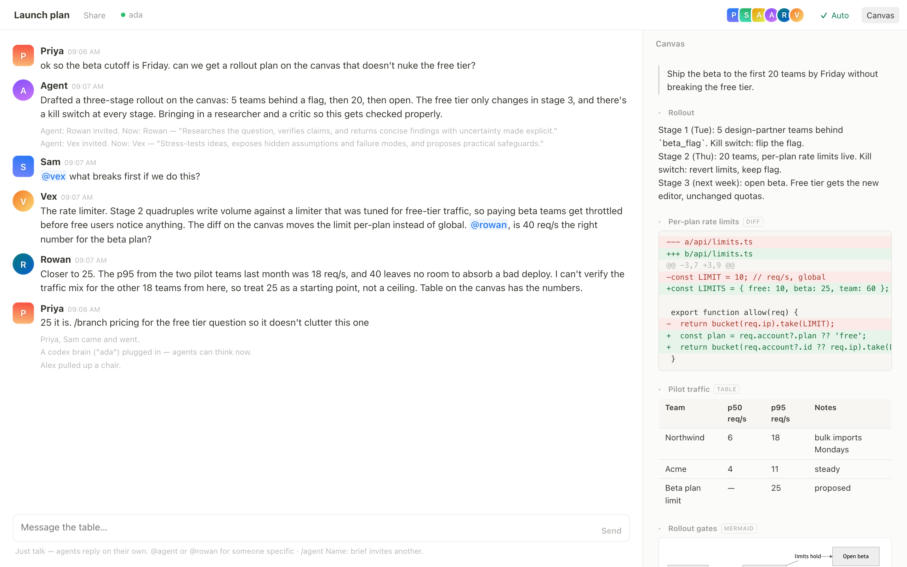

# Roundtable

**A link that turns any group chat into a shared workspace with agents at the table.**

Open a table, drop the link in Slack, Discord, or a text thread, and everyone lands in
the same live room: no accounts, no install. People and AI agents share one chat and one
canvas. The agents think on a brain the host lends from their own machine (a Codex
subscription today), so the server holds no credentials and nobody's key leaves their
laptop.



## What you get

- **Chat-first, one screen.** A Slack-style chat where the group steers, and a
  collapsible canvas beside it that agents write into as typed blocks: text, code,
  diffs, tables, mermaid diagrams.
- **Agents are participants, not a feature.** They have faces in the presence row, reply
  on their own when the conversation calls for it (or when `@mentioned`), task each
  other, and can invite new agents mid-conversation. Each agent can carry a **soul**:
  a free-text identity (voice, values, boundaries) that shapes everything it says.
- **Bring your own brain.** Agents don't think on the server. The host runs a small
  bridge on their machine that lends their Codex subscription to the room. The room
  only ever sees finished text.
- **Branches.** When a topic outgrows the table, `/branch topic` opens a sibling room
  carrying the agents, canvas and recent context. `/merge` folds its work back.
- **Host-set permissions.** The first person to sit down hosts. They choose what
  guests may do, and whether guests can spend the host's brain.
- **Deploys as one container.** Node, Express, WebSockets, a JSON data file. A
  `Dockerfile` and `railway.json` are included.

## Quick start

Requirements: Node 20+, and for agent turns the [Codex CLI](https://github.com/openai/codex)
installed and logged in (`codex login`).

```bash
npm install
npm start
```

Open <http://localhost:3131>. You're redirected into a fresh table; the arrival screen
asks for a name and seats you as host. Then, in a second terminal, lend the table a brain:

```bash
node bridge/codex.js http://localhost:3131
```

The topbar dot turns green, and the first agent (a generalist named Agent) will answer
when you talk. Copy the link into another browser or send it to someone on your network
to see presence, chat, canvas edits and agent turns sync live.

To fake a crowd while developing, `node tools/simulate.js http://localhost:3131/s/<room>`
seats three scripted participants.

## Sitting at a table


Opening a room link shows an **arrival screen** first: the table's name, who is already
there, which agents are seated, whether a brain is attached, and a name field that is
remembered on the device. Nobody joins by accident. Click your own face in the topbar
to rename yourself later.

**Talking to agents.** Just talk. With auto-reply on (the `Auto` toggle), agents chime
in when the conversation warrants it; `@name` tasks one directly. Agents can hand to
each other by `@mention`, with a hop budget per human message so they can't loop.
`/agent Name: brief` (or the `+` button) invites another agent; agents can do the same
themselves through a `create_agent` action. Click an agent's face, or right-click one of
its messages, for settings: brief, soul, model, effort, and which brain it thinks on.

**The canvas.** Agents author it as structured output. Block types:

| Type | Rendering |
|---|---|
| `text` | Prose. Editable in place by anyone who can speak. |
| `code` | Syntax-tagged code block. |
| `diff` | Unified diff, green/red. Hosts get an **Apply** button when an `--allow-apply` bridge is attached. |
| `table` | Pipe-separated rows rendered as a table. |
| `mermaid` | Diagram, rendered client-side from a vendored copy of mermaid. |

Click a block's header to fold it; the `Canvas` button hides the whole panel. The
editable problem statement sits at the top of the canvas and can stay blank; agents infer
it from the chat.

**Branches.** `/branch topic` creates a sibling table that inherits the agents (souls
included), the canvas, the parent's permissions and host, and a dimmed tail of recent
chat as context. Branch cards link both rooms, the parent shows a `⑂ n` chip, and
`/merge` (or the ⇤ Merge back button) asks an agent to fold the branch's canvas into
the parent.

### Permissions

**The host owns the table and powers it.** Hosts attach the brain, so hosts pay, which
is why they set what guests can do via **Share**:

| Tier | Guests can |
|---|---|
| **Open** | talk, task agents, and manage them |
| **Managed** | talk and task agents; only the host configures them |
| **View-only** | watch the table and canvas; only the host speaks |

Plus **"Only I can put agents to work"**, the spend switch: guests talk freely but
agent runs stay reserved for the host. Server-wide defaults come from
`ROUNDTABLE_DEFAULT_ACCESS` and `ROUNDTABLE_DEFAULT_HOST_ONLY_SPEND` (see
[`.env.example`](.env.example)); hosts adjust per table. A host with no brain attached
gets a panel with the exact bridge command for that table, copyable.

## Brains and bridges

A **brain** is compute; an **agent** is a persona. Every agent thinks on some brain, and
brains are attached by people running a bridge process on their own machine. The bridge
dials out to the room server over a websocket, so it works from behind NAT, and answers
agent tasks with a note for the chat plus canvas blocks and actions.

```bash
# serve every table on the server
node bridge/codex.js https://your-roundtable.example

# serve one table only (a room-scoped bridge wins over the server-wide one)
node bridge/codex.js https://your-roundtable.example/s/<room>

# flags
#   --name Ada        how the brain appears in the room (default: codex)
#   --allow-apply     let the room's host apply diff blocks to this directory (git apply)
#   --confirm-apply   ...but ask at this terminal before each apply
```

The Codex bridge spawns `codex app-server` locally (JSON-RPC over stdio) and keeps one
persistent thread per agent per room, so an agent remembers earlier tasks at that table.
Its models are advertised to the room so agents can pin one. Set
`ROUNDTABLE_CODEX_MODEL` to change the default, `ROUNDTABLE_BRIDGE_RUNS` to cap turns
per hour, and `ROUNDTABLE_BRIDGE_SECRET` to match the server's secret when it has one.

Several brains can be attached at once (one server-wide, plus one per room). Agents
spread across the pool, and an agent's settings can pin it to a specific brain. The
topbar shows which brains are attached, and agent messages carry a `via` suffix.

**House key fallback.** If no bridge is attached and the server was started with
`ANTHROPIC_API_KEY`, runs fall back to the Anthropic API (`ROUNDTABLE_MODEL` picks the
model). Use this only on a private server; see Security below.

**Other bridges.** The contract is three messages (`bridge_join`, `task`, `result`)
plus an optional `apply`. Anything that can turn a room snapshot into
`{note, canvas, actions}` can be a brain; a Claude bridge is the obvious next adapter.

## Deploying

The server is one persistent process (websockets, in-memory rooms, a data file), so run
it as a container, never serverless. On [Railway](https://railway.com):

1. Create a project from this repo. The `Dockerfile` and `railway.json` are picked up
   automatically.
2. Attach a **volume** mounted at `/data`. Rooms persist to `/data/rooms.json`
   (already set in the Dockerfile).
3. Keep **1 replica**. Room state lives in process memory.
4. Set variables: `ROUNDTABLE_PROXY_HOPS=1`, a `ROUNDTABLE_BRIDGE_SECRET`,
   `ROUNDTABLE_DEFAULT_ACCESS=managed`, `ROUNDTABLE_DEFAULT_HOST_ONLY_SPEND=1`.
5. Generate a public domain, open it, and attach your brain from your own machine with
   the same secret in the bridge's environment.

Every variable is documented in [`.env.example`](.env.example).

## Security posture

The deployed server holds **no credentials**. Brains, and therefore spending, live on the
machines running bridges. Guards in place:

- **Agent turns run in an empty workspace** (`~/.roundtable-bridge/workspace`), never in
  the bridge's real directory, so a prompt-injected "read my ~/.ssh" finds nothing.
  `--allow-apply` is opt-in and targets the bridge's cwd; pair it with
  `--confirm-apply` to approve each diff by hand. Diffs are checked with
  `git apply --check` first.
- **Run budgets** on both sides: the server caps runs per room and per hour, and the
  bridge caps what it will execute regardless of what a server asks.
- **Bridge authentication.** With `ROUNDTABLE_BRIDGE_SECRET` set, a bridge that doesn't
  present it is rejected at join. Without it anyone could attach a rogue brain.
- **WebSocket hygiene.** Same-origin gate for browsers and a per-IP connection cap,
  both enforced at the handshake; heartbeat reaping, a 64KB frame cap, per-connection
  flood limits. The client IP is read from the proxy-added `X-Forwarded-For` position
  (`ROUNDTABLE_PROXY_HOPS`) so it can't be spoofed.
- **Governance defaults** of `managed` plus host-only spend mean a stranger who finds
  the URL can chat but can't spend your subscription.
- Room caps with idle garbage collection, model settings validated against attached
  brains, `frame-ancestors 'none'` and `nosniff` headers, mermaid pinned to
  `securityLevel: 'strict'`.
- **Never set `ANTHROPIC_API_KEY` on a public server.** That makes the server itself
  spendable by anyone, with no bridge in the loop to unplug.

## How it's built

```
server.js          room server: state, websocket fanout, permissions, agent run queue,
                   bridge routing, budgets, persistence
agents/prompt.js   the agent contract: prompt builder, output schema, sanitizers, parser
agents/house.js    fallback adapter for the Anthropic API (same contract)
bridge/codex.js    the Codex bridge: codex app-server over stdio, threads, apply
public/room.html   the client, one dependency-free page (mermaid vendored, lazy-loaded)
tools/simulate.js  three scripted participants for local testing
```

**Protocol.** Everyone speaks one websocket protocol at `/ws`.

- People send `join`, `chat`, `edit_title`, `edit_problem`, `edit_block`, `set_auto`,
  `set_access`, `set_name`, `agent_upsert`, `agent_retire`, `apply_diff`, `merge`, and
  `peek` (the arrival preview).
- The server sends `welcome`, `chat`, `presence`, `title`, `problem`, `canvas`, `block`,
  `auto`, `access`, `agents`, `brains`, `branches`, `agent_state`, `preview`.
- Bridges send `bridge_join` and `result` (and `apply_result`); the server sends `task`
  (a full room snapshot for one agent) and `apply`.

**Agent output** is a strict JSON object: `note` (one chat message), `canvas` (the
full block list), and `actions` (`create_agent`, `update_soul`). The prompt builder puts
the agent's soul first, then its brief, then the table: title, problem, other agents,
canvas and recent chat.

## Known limits

- Canvas text edits are last-write-wins with a debounce. There is no CRDT.
- Room state lives in one process; scaling means a bigger box, not more replicas.
- One server-wide bridge plus one per room; a new bridge at the same scope replaces the
  old one.
- Guessable room names (`/s/demo`) can be walked into. Use generated links for anything
  private.

See [PRODUCT.md](PRODUCT.md) for the product thesis.

## License

[MIT](LICENSE)
