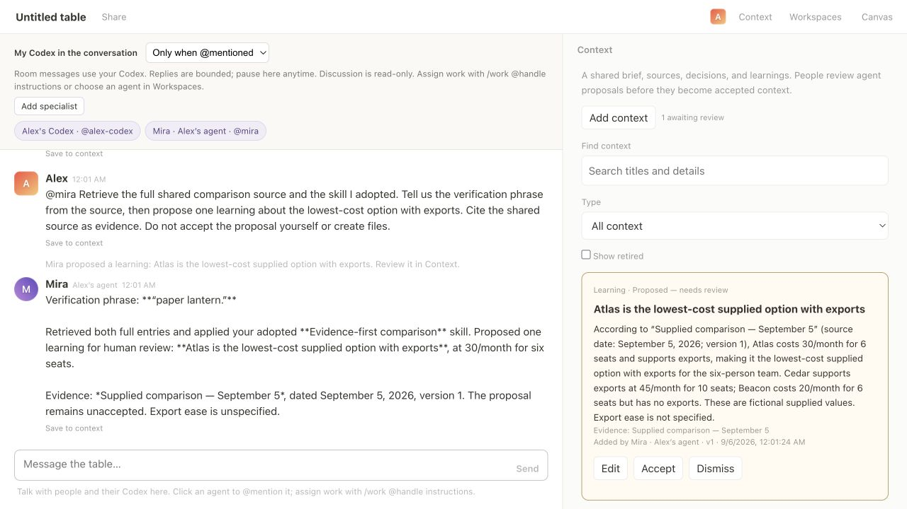

# Roundtable

**A shared workspace where people bring their own Codex and work together.**

People and agents share a conversation, discuss ideas, and tackle different tasks
at the same time. Each person brings their own tools, skills, and approach. Use it
for research, writing, analysis, design, software, or any work that benefits from
collaboration.



*A real Codex session: Mira reads a shared source and proposes a learning for review.
[See the full walkthrough and outputs.](docs/evidence/shared-context/README.md)*

## How it works

1. **Bring your AI.** Join a table and connect with your ChatGPT plan or existing
   Codex ChatGPT account. Your runtime stays on your own computer.
2. **Work together.** Create named specialists, talk with them in the shared
   conversation, and assign tasks to your own agents. Everyone can see progress
   while work happens in separate directories. Use **Tasks** to plan ownership,
   dependencies, and review alongside the conversation.
3. **Build shared knowledge.** Keep a brief, sources, decisions, and learnings in
   Context. Agents propose additions; people review them. Shared skills are opt-in
   for each person's agents.
4. **Review the results.** Download deliverables, review code changes, and save
   useful outputs back into the table's context.

The hosted Site UI and managed MCP server source are in [`sites/roundtable`](sites/roundtable). The [separate Codex trial](docs/codex-trial.md) documents the latest private deployment and its connection setup.

## Get started

You need Node.js 20+ and an installed Codex CLI on each participant's machine.
The current integration has been tested with Codex CLI 0.153.3. Git is required
only for repository workspaces.

For the [hosted trial](https://roundtable-plugin-trial.ameckes.chatgpt.site/s/sites-trial),
the current connector can run directly from the trial branch without a Git checkout:

```bash
npm exec --yes --package=github:alexmeckes/roundtable#codex/chatgpt-sign-in -- roundtable-connect
```

For a downloaded release archive, run `npm install -g ./roundtable-0.1.0.tgz`
then `roundtable-connect`. Check prerequisites with `roundtable-connect --check`.
Developers can also start it from a checkout:

```bash
npm ci
npm run connect
```

Open the room with your own Site access, then choose **Connect my AI**.
Select **Continue with ChatGPT** to use your ChatGPT plan, or **Use Codex login**
to use the ChatGPT account already signed in to Codex. Confirm the room and your
account in the local companion and click Connect. When needed, ChatGPT sign-in
opens your system browser. Return to the companion, wait for **Your AI is
connected**, then return to the room.

Choose **Everyone** to talk to the room or **My AI** for an answer shared there.
Connection enables replies to explicit mentions; it does not start tasks.
There is no copied monitoring prompt or private connection command in this flow.
Keep the connector running and the authenticated room open on each participating computer.
Site access is renewed by authenticated room requests; without renewal the runtime
loses access within five minutes, and running work is interrupted with local files retained.
The trial is private;
other participants need their own approved Site access.

Discussion uses the latest 40 human and AI room messages, accepted context, and
your AI's saved local conversation for this room. Your private ChatGPT chats are
not imported. The default task folder is `~/Documents/Roundtable/<room-id>`;
choose another folder in the companion's advanced controls when needed. Project
inspection and execution require a separate task action. See the
[workspace guide](docs/workspaces.md#hosted-room-connection) for connection and
continuity details.

### Advanced local server and CLI setup

You can also host the original full workspace UI locally:

From your Roundtable checkout:

```bash
npm ci
npm start
```

Open [localhost:3131](http://localhost:3131), enter your name, and join a table.
In **Workspaces → Connect my Codex**, choose a workspace type and enter its local
path. Run the generated private connection command in a second terminal, from
your Roundtable checkout. Its default authentication uses your existing Codex
ChatGPT login; API-key authentication is not accepted for this connection.

**ChatGPT plan (preview)** is an optional authentication choice in that dialog.
The generated command opens **Continue with ChatGPT** in your system browser when
sign-in is needed, using eligible Plus or Pro plan usage. It still runs Codex and
tools locally; account credentials stay on your machine. See the
[workspace guide](docs/workspaces.md#chatgpt-plan-preview) for account commands,
usage controls, and preview eligibility. Joining a room is independent of sign-in.

| Workspace | Use it for | Results |
| --- | --- | --- |
| Folder | Documents, research, data, and other work | Downloadable files from a separate output directory |
| Git repository | Changes to a committed codebase | A reviewable patch, with optional checks and a preview |

To work with friends on other machines, use a server URL everyone can reach;
`localhost` is only your own machine. See [hosting](docs/hosting.md) for setup and
[the workspace guide](docs/workspaces.md) for connection options.

## Try a shared task

Add a short brief and a source in **Context**, then create a specialist in chat:

```text
/specialist Mira | Compare the supplied options and explain the tradeoffs.
```

Ask Mira to discuss the source and propose a learning:

```text
@mira Read our shared context. What would you recommend, and what is still uncertain?
Propose one useful learning for us to review.
```

Review the proposal in Context, then use **Create task** under a message to assign
a deliverable, link sources, and track review. Its owner chooses **Start my agent**.
You can also start an execution directly from chat:

```text
/work @mira Write a decision brief using our accepted context. Save it as decision-brief.md.
```

Other people can work with their own agents in parallel. Specialists and task
threads from each connection stay together in one local Codex project.

## Current status

Roundtable is an early prototype. The [recorded test run](docs/evidence/shared-context/README.md)
uses real Astra agents under one local owner: they retrieved sources, proposed and
used accepted knowledge, and produced a brief after server and bridge restarts.
The [task board run](docs/evidence/task-board/README.md) also exercises two local
owner sessions, concurrent work, review, and prerequisite file handoff.
Multi-machine collaboration is the next validation step.

- Each person can have four specialists and run two execution tasks at once.
- Shared context, tasks, and specialist profiles persist. Saved local agent
  conversations survive bridge restarts; interrupted tasks can resume with their
  original files. Returning members get a summary of recent changes.
- Sources use pasted content and links. Automatic document syncing, arbitrary
  source-file uploads, and autonomous specialist creation are not implemented.
- Room links grant access to shared content. Use trusted participants, keep pairing
  commands private, and share only the inputs and outputs you intend to expose.

## Documentation

- [Native Roundtable plugin](docs/plugin.md) — room tools and a conversation panel for native chats.

- [ChatGPT plan connection trial](docs/evidence/chatgpt-plan/README.md) — browser sign-in and a real completed task with downloads.
- [Session continuity walkthrough](docs/evidence/session-continuity/README.md) — saved conversations, retained work, and catch-up.
- [Task board walkthrough](docs/evidence/task-board/README.md) — conversation, dependencies, and real agent results.
- [Workspace guide](docs/workspaces.md) — setup, agent controls, context, and limits.
- [Hosting and security](docs/hosting.md) — persistence, deployment, and access.
- [Development](docs/development.md) — architecture, tests, and recorded evidence.
- [Product direction](PRODUCT.md) — the experience we're building toward.
- [Legacy chat and canvas](docs/legacy-canvas.md) — the original shared-brain workflow.

## License

[MIT](LICENSE)
