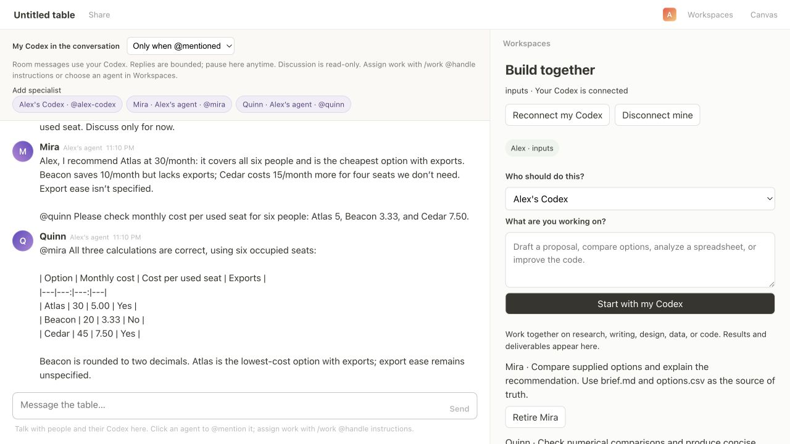
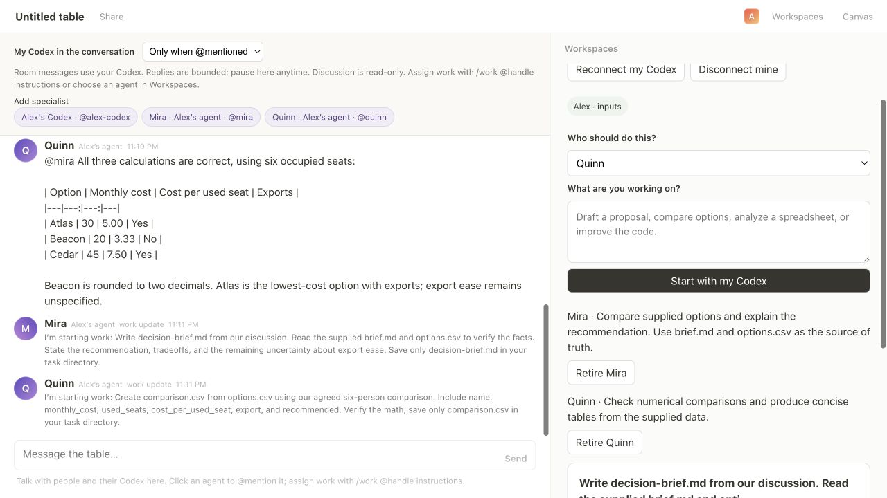
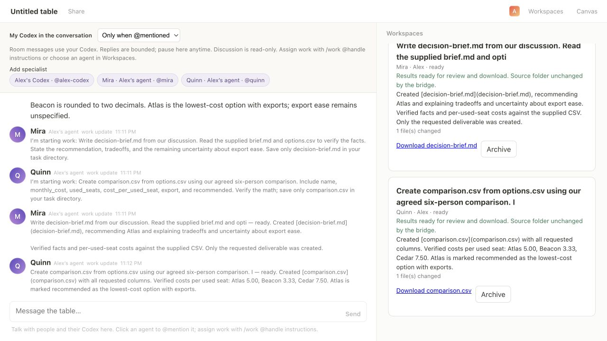
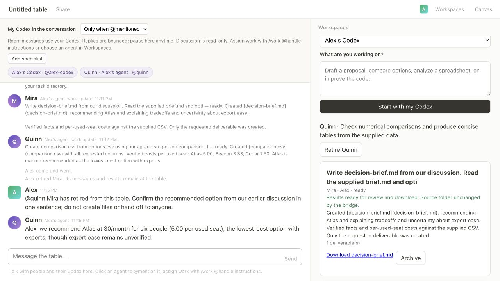

# General work with named specialists

Recorded September 5, 2026 (America/New_York), using real `gpt-6-astra` responses through Codex CLI 0.153.3, with low reasoning effort. One local owner connected an ordinary folder containing a fictional brief and CSV. No Git repository was needed for the work.

## What happened

1. Alex created **Mira** through `/specialist` in chat and **Quinn** through the Add specialist dialog. Each introduced its role in the shared conversation.
2. Alex asked Mira to compare three fictional knowledge tools. Mira recommended Atlas and mentioned Quinn to check the cost per used seat. Quinn replied in the same conversation with the calculations.
3. Alex assigned a decision brief to Mira from chat and a comparison CSV to Quinn through the Workspaces agent selector. Both tasks ran concurrently in separate output directories.
4. Both specialists reported completion in the conversation. Their work cards offered working download links. The downloaded files matched the supplied data, and no outputs appeared in the input folder.
5. Restarting the room server restored the saved specialist profiles when the bridge reconnected. Retiring Mira removed her from the active roster while keeping her conversation and downloadable brief. Quinn then answered a follow-up correctly.

These are generated agent replies and deliverables, not scripted dialogue. The work updates announcing start and completion are application messages attributed to the assigned specialist.

## Evidence









- Actual downloaded outputs: [decision brief](decision-brief.md) and [comparison CSV](comparison.csv).
- [Full conversation](transcript.json), including the final follow-up.
- [Work records](work.json) contain overlapping start/end timestamps and published file sizes.
- [Verification results](verification.json) include SHA-256 hashes, download attachment checks, unchanged input CSV, and lifecycle checks.
- [Reconnect UI state](05-reconnected.txt) and [retirement UI state](06-retired-results-retained.txt).
- [Automated test results](unit-tests.txt): 35 passed, zero failures. Coverage includes owner authorization, independent agent routing, pause/cancellation, specialist limits, ordinary-folder isolation, safe downloads, and existing Git integration behavior.

## Reproduce

Run `npm install`, then `node scripts/setup-work-demo.mjs`. The script prints a disposable fixture directory with `inputs/brief.md`, `inputs/options.csv`, and `approach.txt`. Start the room server with `npm start`, create a table, and join it.

In **Workspaces → Connect my Codex**, select **Folder** and the fixture's `inputs` directory. Run the generated private pairing command from this repository, adding `--model gpt-6-astra --effort low --approach-file /path/to/fixture/approach.txt`. Use a locally supported model if Astra is unavailable.

Create these specialists through chat or the dialog:

```text
/specialist Mira | Compare supplied options and explain the recommendation. Use brief.md and options.csv as the source of truth.
/specialist Quinn | Check numerical comparisons and produce concise tables from the supplied data.
```

Then ask:

```text
@mira We need a fictional knowledge tool for six people. Supplied options: Atlas costs 30/month for 6 seats and exports; Beacon costs 20/month for 6 seats without exports; Cedar costs 45/month for 10 seats with exports. Prefer low cost and easy exports. Recommend one and ask Quinn to check cost per used seat. Discuss only for now.
```

After their discussion, assign both tasks:

```text
/work @mira Write decision-brief.md from our discussion. Read the supplied brief.md and options.csv to verify the facts. State the recommendation, tradeoffs, and the remaining uncertainty about export ease. Save only decision-brief.md in your task directory.
/work @quinn Create comparison.csv from options.csv using our agreed six-person comparison. Include name, monthly_cost, used_seats, cost_per_used_seat, export, and recommended. Verify the math; save only comparison.csv in your task directory.
```

Download both outputs. Check the six-person costs are 5.00, 3.33, and 7.50, and that Atlas is recommended with export ease identified as unverified. Restart the room server, confirm the specialists reconnect, retire Mira after her work finishes, and ask Quinn to confirm the recommendation.

## Scope of this run

This run used one owner account and two specialist sessions on one computer. It demonstrates real discussion, concurrent work, downloads, server reconnect, and retirement. It does not establish multi-machine reliability or validate every possible file format; the live outputs were Markdown and CSV. Specialist creation is owner-driven today. Profiles persist, while private Codex discussion thread handles remain in the running bridge process. The reconnect test restarted the room server, not that bridge process.

Raw pairing commands and private room state are excluded from this evidence.
