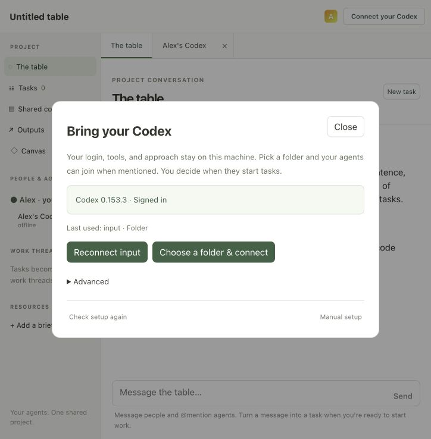
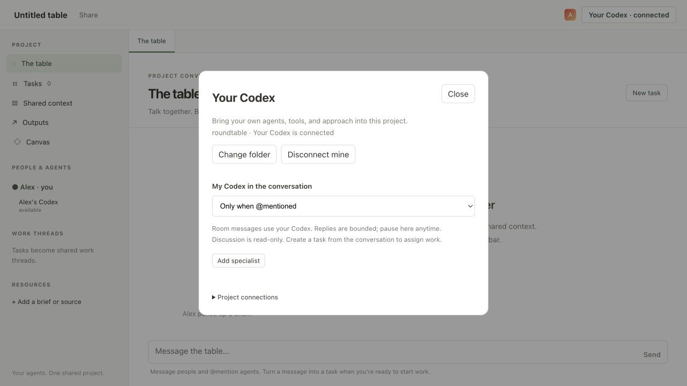
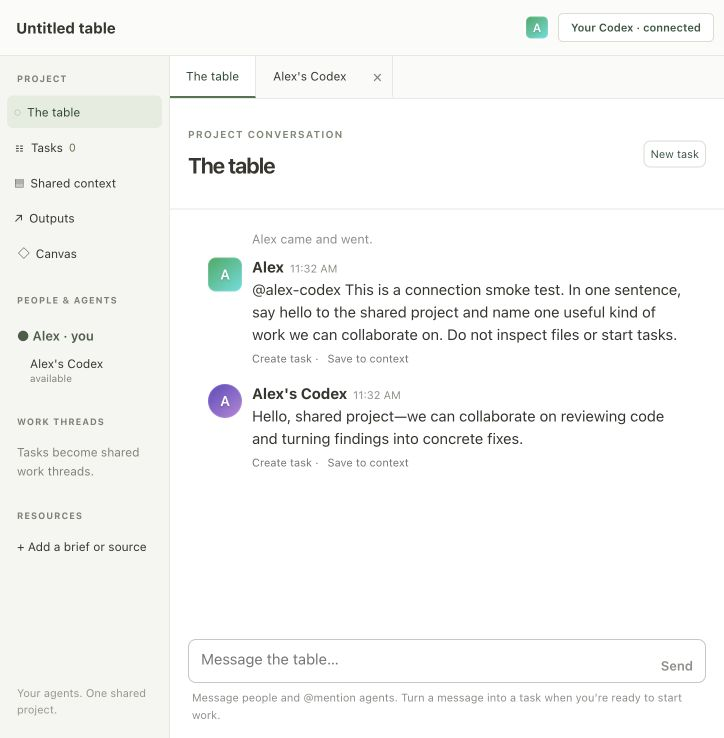
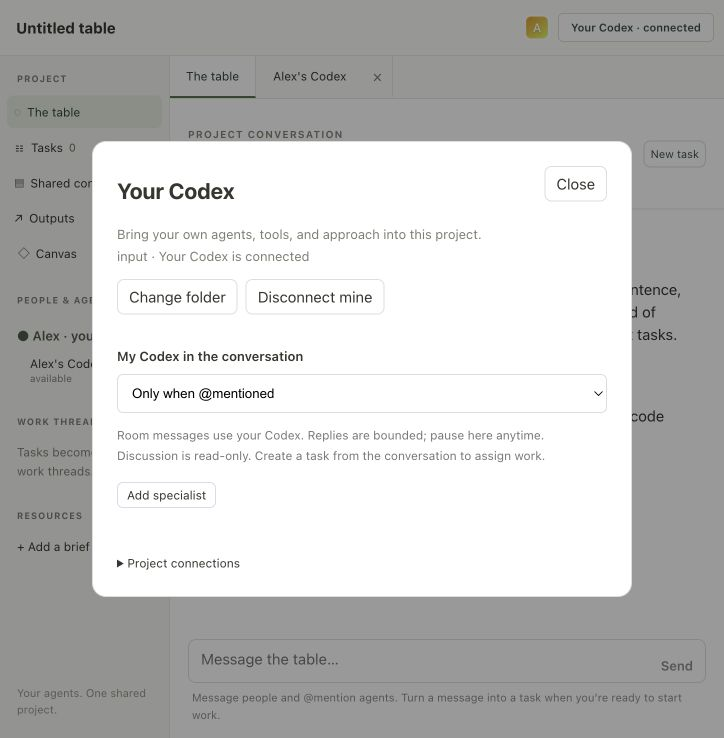
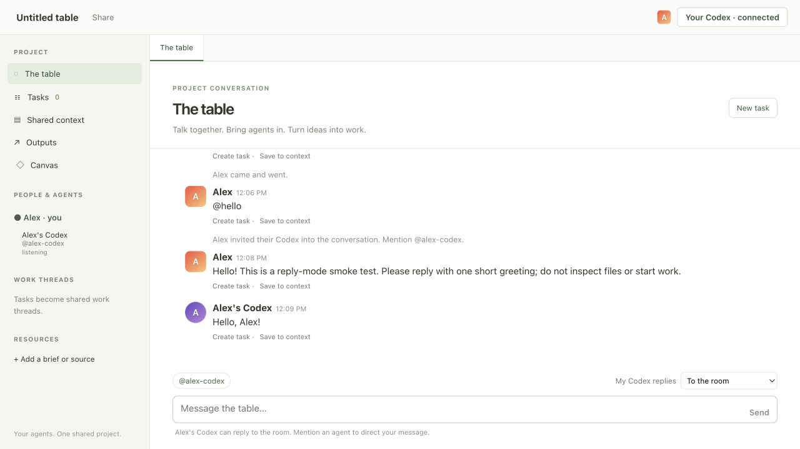

# Local Codex connection

Recorded on September 7, 2026, on macOS with Codex CLI 0.153.3 and an existing
ChatGPT sign-in. This is a single-owner local smoke test, not a multi-machine pilot.

## Simplified setup

Clicking **Connect your Codex** detects the installed CLI and login. First-time
setup reuses the launching Codex project when known, falling back to a native folder
picker; a saved connection reconnects automatically.
The setup view keeps folder overrides and validation settings under Advanced.

The native Mac picker completed and a managed bridge connected. During testing,
its JXA modal result was found to be a string; converting it to a number fixed
successful selections being treated as cancellations. Subsequent conversation and
restart checks used a disposable `input` folder selected through Advanced's path
field. No pairing token was copied and no bridge terminal was started manually.
The native dialog itself is not captured in these browser screenshots.

## Inherit the launching Codex project

A fresh room was opened with no saved connection. Clicking **Connect your Codex**
connected to the `roundtable` repository from the launching Codex thread's metadata.
No picker, path entry, or bridge command was required. The connection was then
explicitly disconnected; no execution tasks were started in the repository.

This follows the launching thread's project, not subsequent Codex tab selection.

## Real agent exchange

The automatically launched bridge used the existing CLI login. Its agent answered
an explicit mention in the shared conversation. The smoke-test prompt requested
one sentence and no file inspection or execution task.

> Hello, shared project—we can collaborate on reviewing code and turning findings into concrete fixes.

## Restart and cleanup

The test server received SIGTERM; its managed bridge process exited. Starting the
server again restored the saved folder connection automatically. The conversation
was still present, the agent was available, and participation remained **Only when
@mentioned**. There were zero tasks before and after the restart.

Changing folders disconnected the old bridge and opened setup without immediately
reconnecting it. Disconnect cleanup left no managed bridge process, preserved the
last folder for an explicit future connection, and stored `enabled: false` so the
next server restart would not restore it. The settings file had mode `0600`.
The disposable server was stopped after testing.

## Automated coverage

[Full test output](unit-tests.txt): **69 passed, 0 failed**. New checks cover:

- Loopback socket, exact Origin/Host/port, JSON, forwarded-header rejection, and disabled manager access.
- Current room-member authentication and owner-scoped folder selection.
- Literal process arguments and pairing tokens excluded from status and saved settings.
- Duplicate startup, reconnecting bridge protection, cancellation, and stopped child cleanup.
- Saved connection restoration, explicit disconnect, cancellation disabling restore, and preservation of pause.
- Launching-thread metadata discovery, runtime cleanup, and connecting without a picker.
- Canonical folder detection, repository baselines, subfolders, symlinks, and file rejection.

Windows and Linux picker implementations have not been exercised on real desktops.
Fresh CLI installation and interactive login were not repeated: this machine was
already installed and signed in. Hosted tables continue to use manual pairing;
a standalone desktop companion is a separate step.

## Reply routing is visible

The composer now shows clickable agent handles and the owner's reply mode. Typing
`@hello` displayed “No agent named @hello”; sending it returned private guidance
with the real handle. Clicking `@alex-codex` replaced the unknown handle. Switching
**My Codex replies** to **To the room** then produced a real agent greeting in
response to an ordinary message without any mention.

The added regression checks that unmatched mentions receive guidance only on the
sender's connection, correct mentions still dispatch, and paused agents stay paused.
