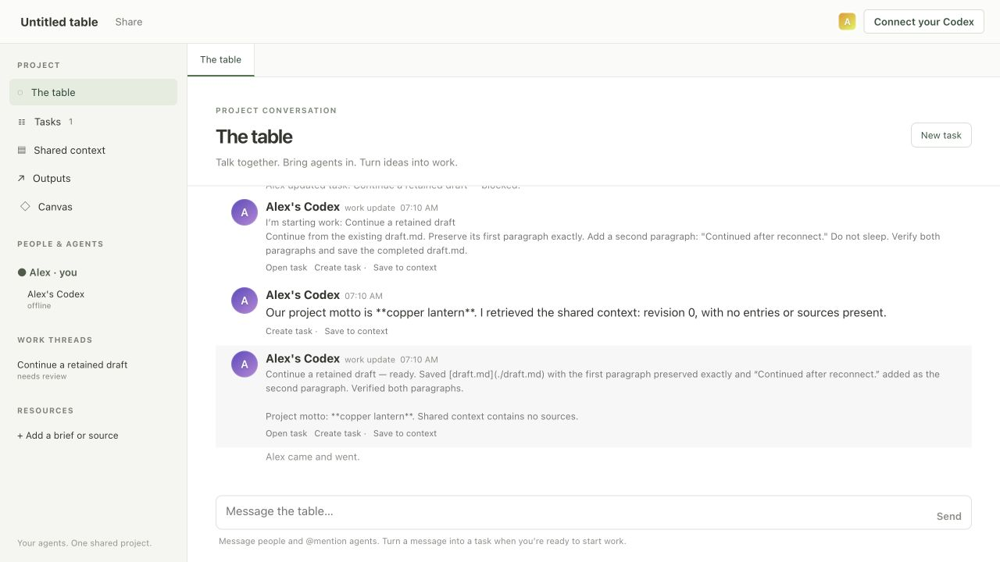
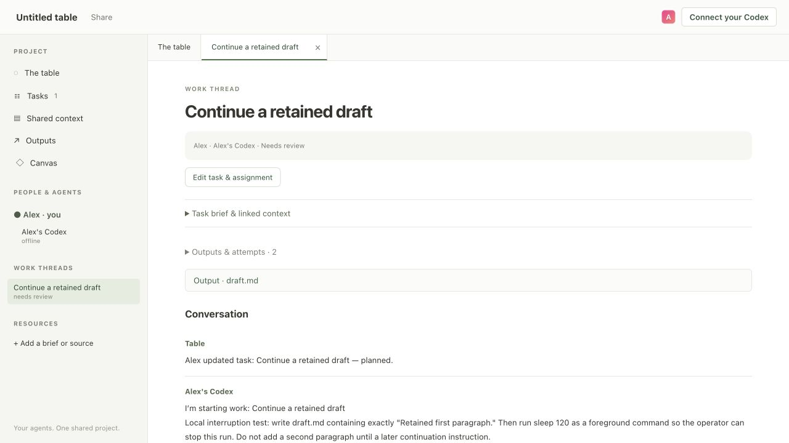
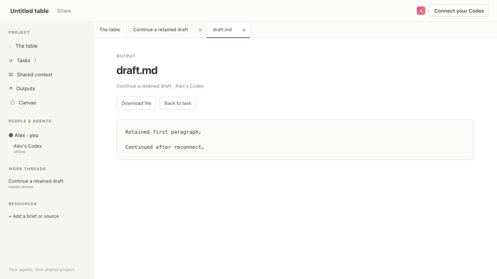
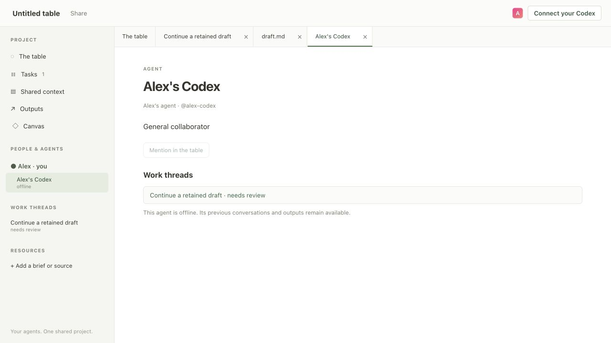
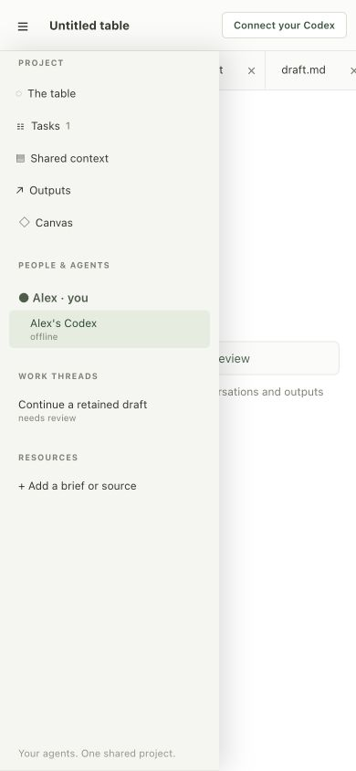

# Shared project interface

Captured September 7, 2026. The interface now has a project sidebar and one main
area with tabs for conversations, tasks, agent profiles, context, canvas, and outputs.
Connection settings are in the header. The separate Workspaces execution form is gone.

## Conversation and project navigation

People, agents, and work threads stay accessible while the shared conversation
occupies the main area.

## Tasks are shared work threads

Task discussion has its own main view and also appears in the table. The owner’s
start, stop, and resume controls are reused from the task board. Briefs and prior
attempts can be expanded when needed. Planning or opening a tab never starts an agent.

## Outputs and agent profiles

Text deliverables open in a read-only tab, with a download link and a route back
to the task. Other file types remain downloadable; patch review and previews
remain available under Outputs. An agent’s profile shows its role and assigned
work, including while it is offline.

## Narrow screens

The project menu opens a navigation drawer. Selecting a task closes it and opens
the task in the main area. The viewport override used for this check was reset.

## Validation and scope

The screenshots display the real conversation and retained draft from the earlier
[single-owner continuity test](../session-continuity/README.md). That agent was
already stopped and archived; these captures do not represent a new agent run or
a multi-person pilot.

A separate local UI check created a task and shared context, sent a task message,
and verified that it also appeared in the table. Browser checks verified:

- Task, agent, context, and output navigation; closing and reopening tabs.
- The retained draft loads as text, and its task remains reachable.
- An unsent task message survives a trip to the output tab and back.
- Offline agents remain inspectable and cannot be mentioned through their profile.
- A saved resource appears in the sidebar and selects its context entry.
- The header connection action opens the pairing dialog directly.
- Mobile navigation opens and closes correctly; no browser errors were reported.

[Automated test output](unit-tests.txt): 58 passing tests. The identity regression
also verifies that people sharing a display name retain distinct public member
IDs in welcome and presence messages. Browser script syntax, element references,
and duplicate HTML IDs were checked. No new shared or multi-machine test was run.

Tabs and unsent task messages are local to the current page session. Shared
conversation, tasks, context, and agent continuity retain their existing persistence.
