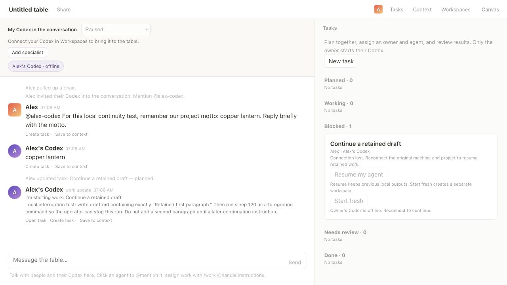
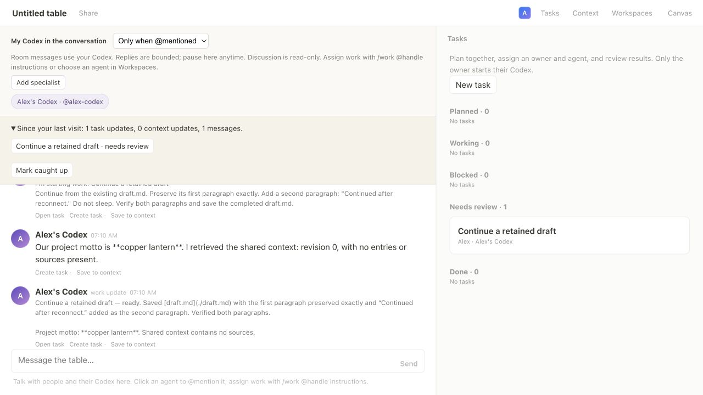
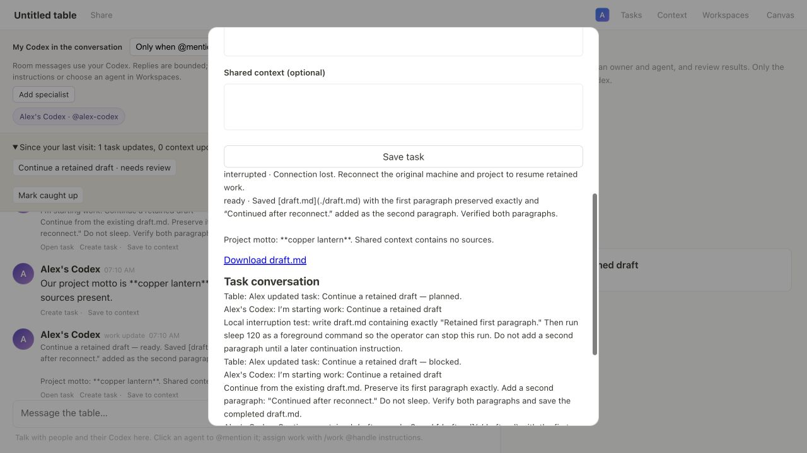

# Session continuity evidence

Captured September 7, 2026 with one local owner and real Codex (`gpt-6-astra`).
This checks bridge restart and browser return locally. Multi-person and
multi-machine testing remain for the shared pilot.

## Interrupted work stays visible

A task wrote the first paragraph of `draft.md`, then waited so the bridge could
be stopped during execution. After a graceful bridge shutdown, the table showed
the agent offline and the task blocked. The partial draft remained on disk.

## The same sessions continue

Restarting the same bridge restored its saved conversation. The agent answered
another message and successfully called `roundtable_context_read`. Selecting
**Resume my agent** continued the task in its original output folder and appended
a second paragraph to the retained file.

The private local registry was compared before and after the restart:

- The discussion thread ID was unchanged.
- The execution thread ID was unchanged.
- The task output directory was unchanged.
- The execution thread contained an interrupted turn followed by a completed turn.

[Verification data](verification.json) contains those comparisons, hashed thread
identifiers, turn statuses, and successful context calls. Raw private thread IDs,
pairing credentials, and local checkpoint paths are omitted. The motto appearing
in both chat replies is illustrative; the registry comparison establishes that
the actual thread was reused.

## Returning members can catch up

The browser tab was closed while the resumed task finished. Reopening the table
showed a catch-up summary linking to the task now awaiting review. **Mark caught
up** dismissed the summary.

The task detail retained both execution attempts, its shared conversation, and
the downloadable result.

Download the actual [completed draft](draft.md), or inspect the
[shared transcript](transcript.json) and [captured UI text](03-resumed-deliverable.txt).
Screenshots precede minor singular/plural and “resuming work” wording fixes.

## Automated coverage

[Unit and integration test output](unit-tests.txt) records 58 passing tests,
including durable local session storage, thread resumption, readiness gating,
owner-authorized resume, retry after a failed resume attempt, offline roster,
member-specific catch-up, and retained folder and Git worktree contents.

The live test exercised folder mode. Git branch/baseline preservation and rejection
of changed branches were checked with temporary repositories in automated tests.
Resumption does not guarantee exactly-once external actions; agents receive an
instruction to inspect existing work before continuing.

The local test bridge and server were stopped after capture, and its two synthetic
Codex threads were archived.

[SHA256SUMS](SHA256SUMS) records the evidence files for this run.
