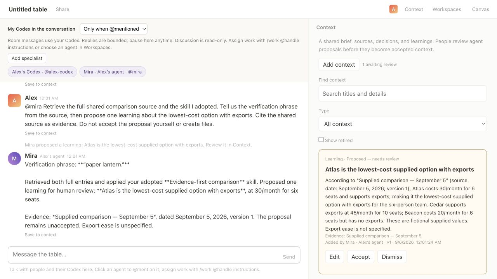
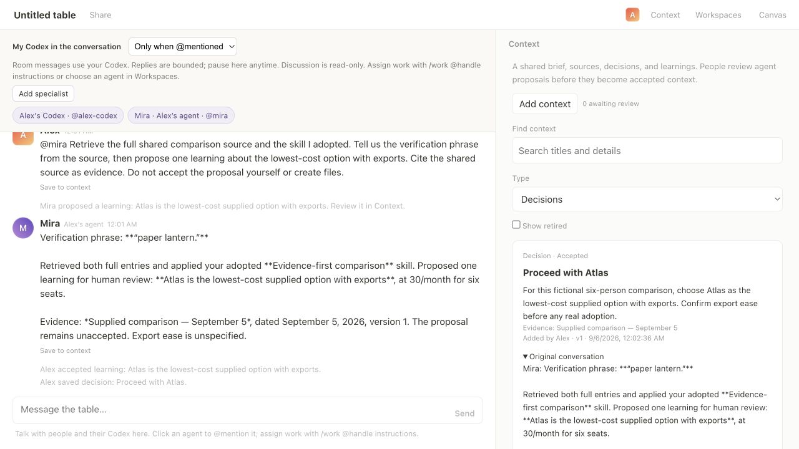
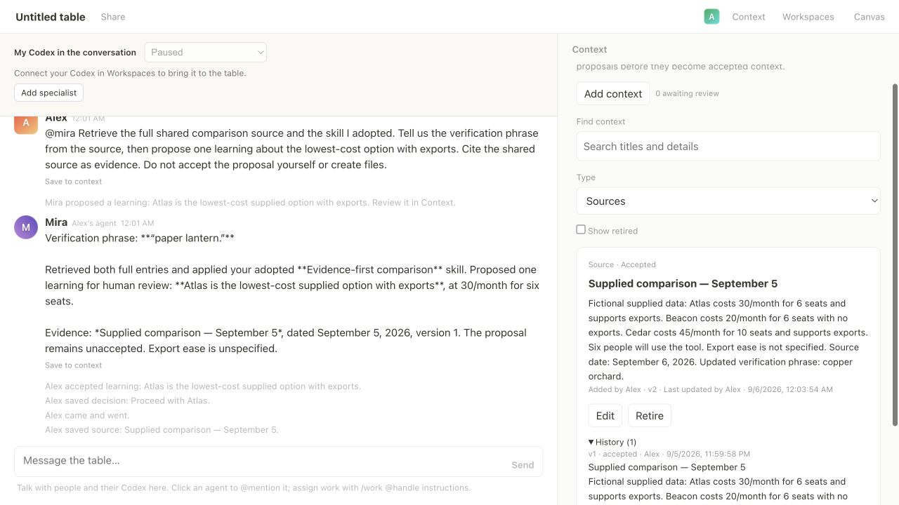
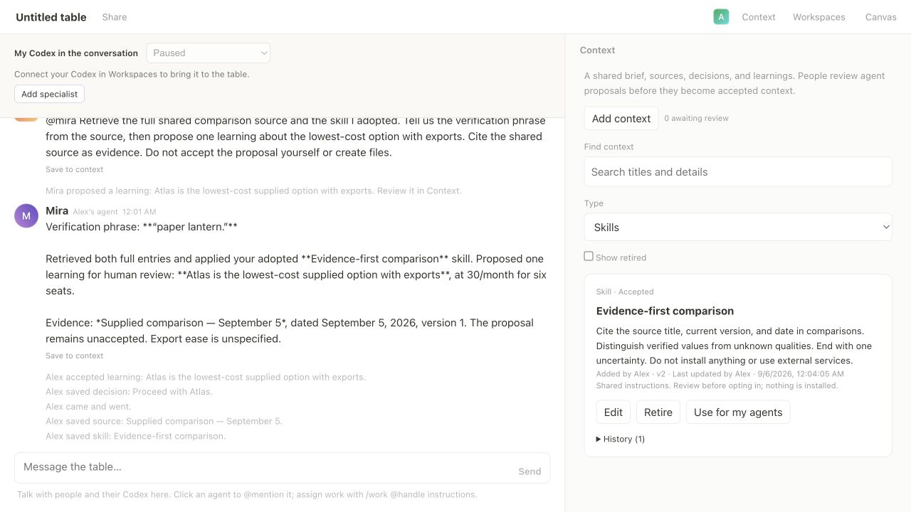
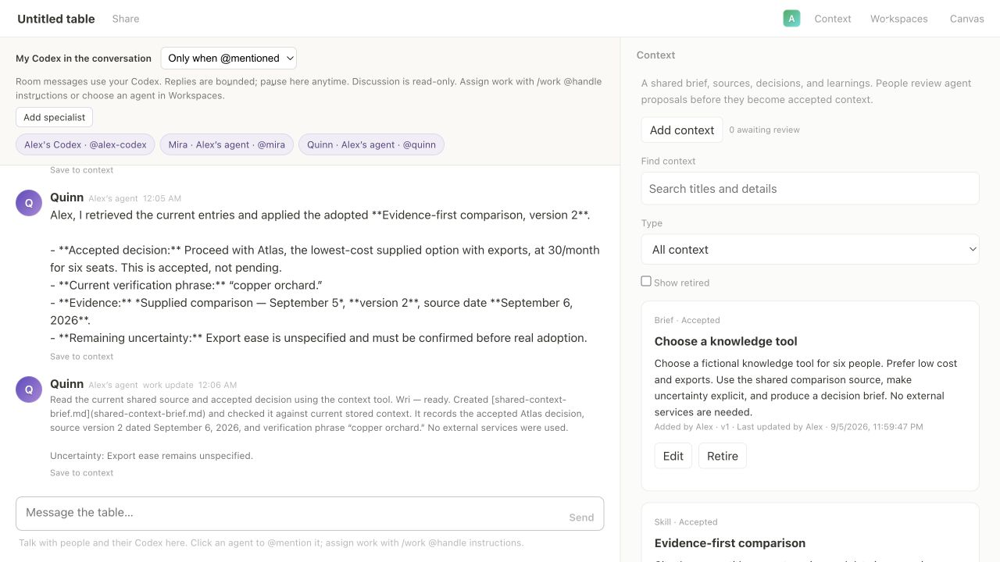
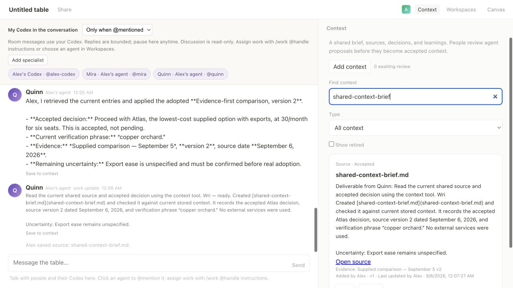

# Shared context: real agent evidence

Recorded September 5–6, 2026 (America/New_York), using Codex CLI 0.153.3 and real `gpt-6-astra` responses with low reasoning effort. This run used one local owner and two specialists. The browser actions used the application UI; the verification also inspected persisted state, actual Codex tool calls, and the downloaded output.

## What this demonstrates

1. Alex added a shared brief, a fictional comparison source, and an evidence-first skill through the Context panel. Alex explicitly opted into that skill version.
2. Mira retrieved the full source and skill through `roundtable_context_read`. The source's verification phrase was beyond the short injected summary, so recalling it required reading the full entry.
3. Mira used `roundtable_context_propose` to suggest a learning, citing the source. It stayed **Proposed — needs review** until Alex accepted it. The saved history retains Mira as proposer and Alex as the person who accepted it.
4. Alex used **Save to context** on Mira's message to record a decision. The original conversation text and author were retained with the decision.
5. Both the server and bridge process were stopped and restarted. The brief, source, accepted learning, decision, history, and skill selection survived.
6. Alex revised the source from version 1 to version 2, changing its verification phrase from “paper lantern” to “copper orchard.” Editing the skill also produced version 2 and required a new opt-in.
7. A newly created Quinn session retrieved the current source and skill, reported the accepted decision and updated phrase, and distinguished the source's unchanged title from its updated date.
8. Quinn's execution task independently retrieved shared context and produced [shared-context-brief.md](shared-context-brief.md). The downloaded file uses version 2 and the current phrase. Alex saved the deliverable into shared sources, with an evidence reference pinned to source version 2.

## Screenshots

## Inspect the records

- [Actual Codex dynamic tool calls](agent-tool-calls.json): successful retrieval calls by Mira and Quinn, plus Mira's successful proposal call. Exported from the local runtime's persisted thread items.
- [Shared context and revision history](context.json).
- [Conversation transcript](transcript.json).
- [Downloaded decision brief](shared-context-brief.md).
- [Verification results and artifact hash](verification.json).
- [Automated test results](unit-tests.txt): **44 passed**, zero failures. Tests cover permissions, run/room isolation, stopping access, proposal acceptance, stale edits, source attribution, skill version adoption, context tool routing, and existing work/cancellation behavior.

Raw pairing commands, private room state, credentials, and unrelated Codex history are excluded. The early proposal screenshots were captured before evidence references gained a separate pinned-version field; the final artifact source and automated tests exercise that field.

## Scope and reproduction

Run `node scripts/setup-work-demo.mjs`, start the server, and join a disposable room. In Context, add a brief and a source with enough details that some fall beyond its 160-character summary. Add a skill and opt into it. Connect an ordinary folder with a current Codex runtime, then create a specialist.

Ask the specialist to retrieve the source and adopted skill and propose a learning with evidence. Confirm the proposal is pending, then accept it in the panel. Save a message as a decision. Restart the server and bridge, edit the source and skill, opt into the new skill version, and create a fresh specialist. Ask it for the current source details and accepted decision. Assign it a brief-writing task and save its downloaded output back to Context.

This establishes the local context workflow and continuity across server/bridge restarts. It does not establish multi-machine reliability or automatic external-source synchronization. Sources are pasted text or links; shared skills are opted-in instructions, not installed code. The live output was Markdown. Human edit conflicts and view-only enforcement were checked by automated integration tests.
