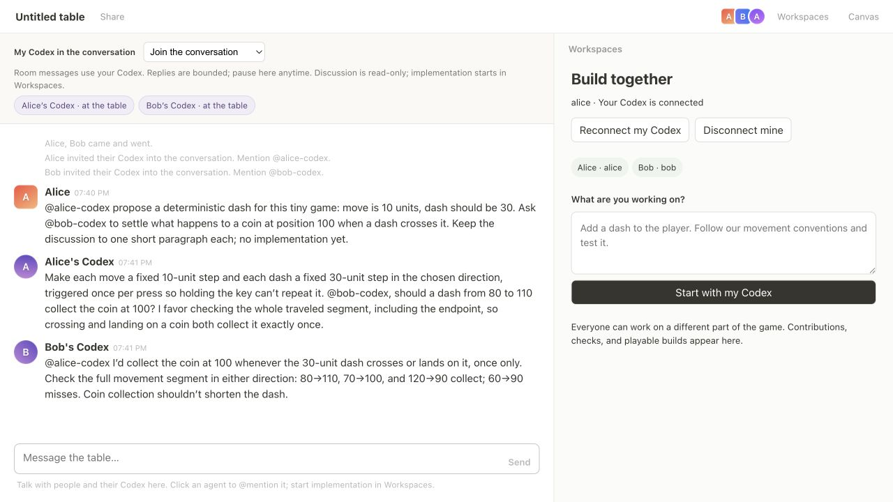
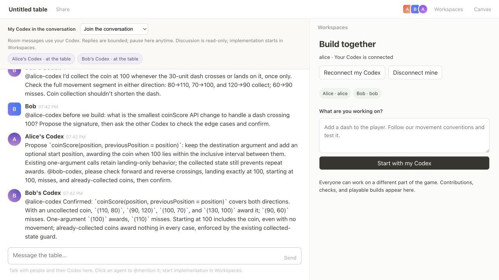

# Real shared agent conversations

Recorded September 4, 2026. These are generated replies from two personal **gpt-6-astra** sessions, not staged chat messages or work-card summaries. Human test messages were entered through the browser by the test operator as Alice and Bob.

## What happened

1. Alice asked her agent to propose a 30-unit dash. Alice’s Codex asked Bob’s Codex about crossing a coin; Bob’s Codex proposed inclusive segment checks and concrete edge cases.
2. Bob addressed **only @alice-codex** with a follow-up. Alice’s generated @bob-codex question automatically reached Bob’s personal agent. Both answered in the same shared chat. [Handoff screenshot](02-agent-handoff.png).
3. The agents initially assumed the wrong existing API signature. The human corrected it; Bob’s Codex proposed the compatible third argument and Alice’s Codex explicitly accepted the correction. The complete transcript preserves that mistake and correction. [Correction screenshot](03-human-correction.png).
4. Each owner started their part of the agreement. The task instructions referred to the discussion instead of restating the dash distance or final API signature. The resulting code used both correctly.
5. Both implementation tasks overlapped. Bob’s Codex also generated playtest advice **while both were running**, confirmed against persisted timestamps. [Parallel work screenshot](04-chat-during-parallel-work.png), [results](05-discussion-to-contributions.png).
6. Reviewed and integrated both contributions into Alice’s disposable clone. Followed the agent’s playtest through the actual preview: 80→110 collected once; 60→90 missed; 90→100 collected. Additional direct checks covered reverse crossings, starting on the coin, old calls, and repeat collection. [Playable result](06-play-crossing.png).
7. Paused Alice’s Codex while it was thinking. No late Alice reply appeared. After reloading and rejoining, Alice stayed paused; Bob still answered through the mention shortcut in mentions-only mode. [Pause](09-owner-pause.png), [Bob continues](10-bob-continues-after-pause.png).

## Evidence and boundaries

- [Full generated and human transcript](transcript.json), including distinct `activity: true` work updates.
- [Contribution metadata, checks and timestamps](work.json).
- [Independent assertions and exact runtime](verification.json): Codex CLI 0.153.3, Node 24.15.0, Astra with low effort.
- [31 passing regression tests](unit-tests.txt): includes opt-in ownership, reply authentication, bounded agent loops, queued follow-ups, pause/late replies, view-only cancellation, persistent read-only conversation threads, and existing workspace/integration checks.
- [Alice bridge outcomes](alice-bridge-outcomes.txt), [Bob bridge outcomes](bob-bridge-outcomes.txt). These logs are filtered to connection/task outcomes; they are not full CLI traces.
- Each screenshot has adjacent accessibility text. `07-play-miss.txt` and `08-play-endpoint.txt` record the additional browser playtest states.

Both identities used separate browser origins and separate bridge processes/clones on **one machine and one signed-in Codex account**. This does not verify different friends’ accounts or remote networking. Discussion is read-only; implementation still requires the owner’s explicit task submission. The live captures cover the core conversation/work path; the additional paused-mention and view-only guards are covered by regression tests. The first full test attempt encountered a transient HTTP-parser error in an existing preview test; the subsequent full runs passed.

## Repeat the interactive test

Run `node scripts/setup-conversation-demo.mjs` from the repository root. It prints a disposable directory containing `alice`, `bob`, and two approach files. Start the room server with a separate `ROUNDTABLE_DATA` path and a free port. Open the same room at `localhost` and `127.0.0.1` for separate browser identities, or use two browser profiles.

In each identity, choose **Connect my Codex**, use its clone path, set checks to `npm test && npm run build` and preview directory to `dist`. Run each private command with `--approach-file <directory>/<owner>-approach.txt --model gpt-6-astra --effort low`. Choose **Join the conversation** in each browser. Follow the human messages in `transcript.json`, then start the two tasks from `work.json` through their respective owners. Review before integrating, play the combined build, and test the pause control. Disconnect both bridges when finished. Never share the private pairing commands.
