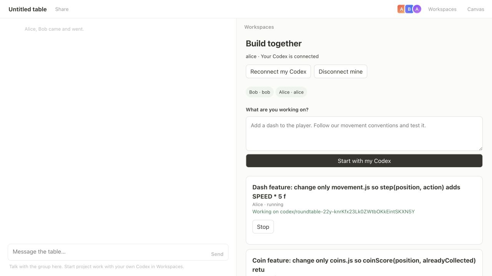
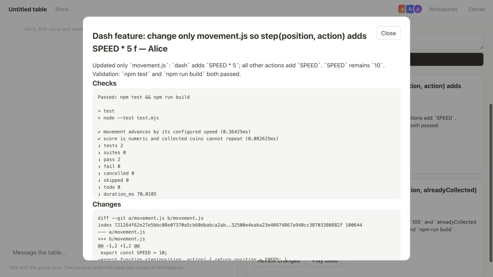
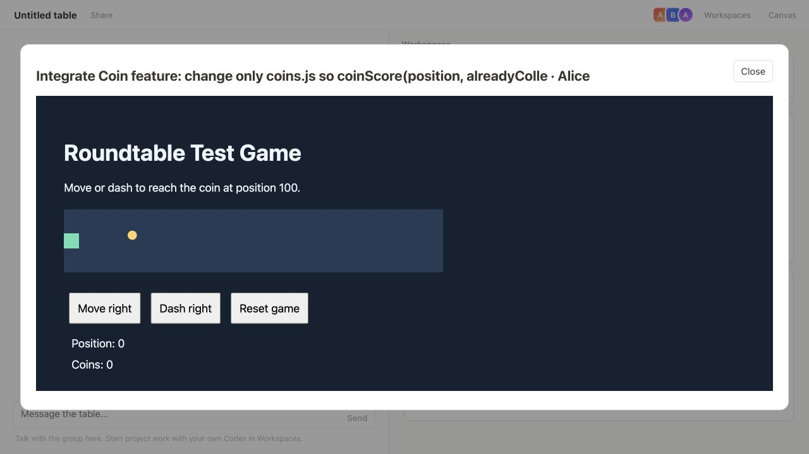
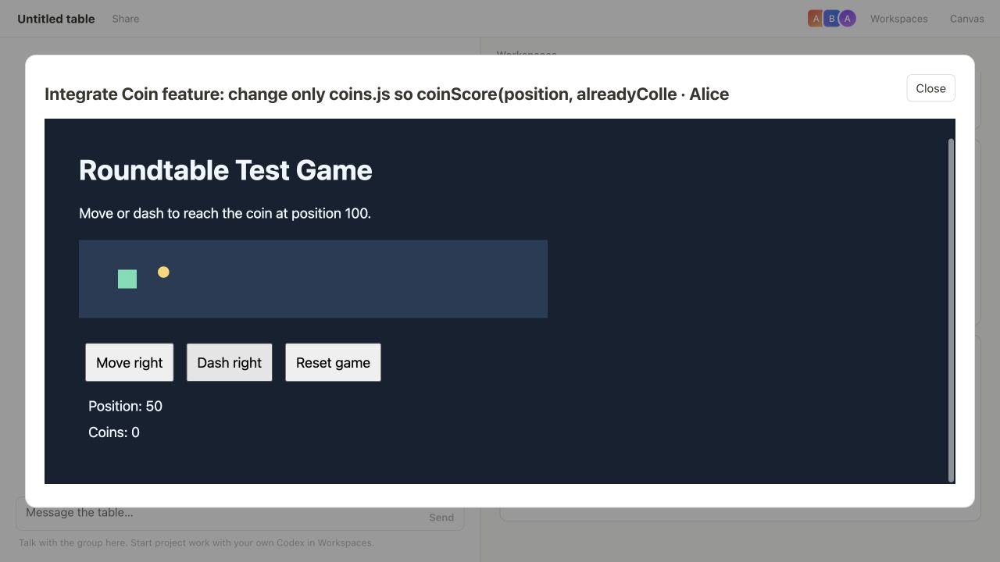
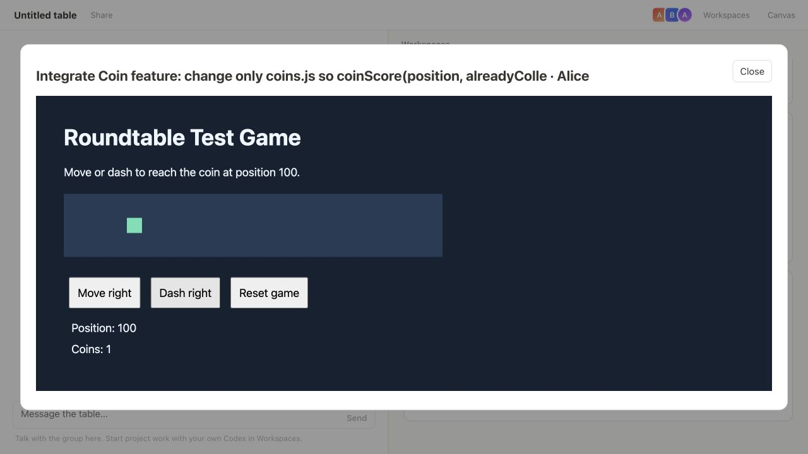
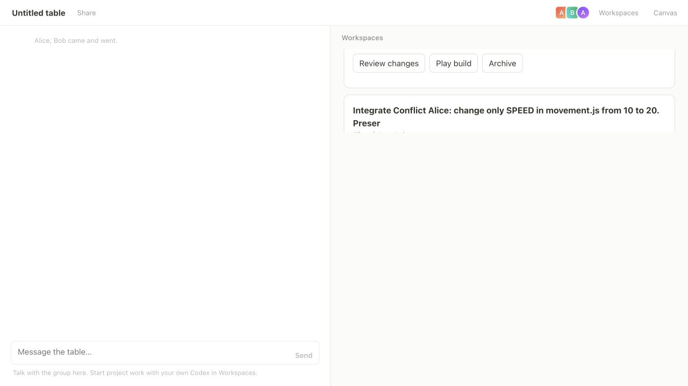
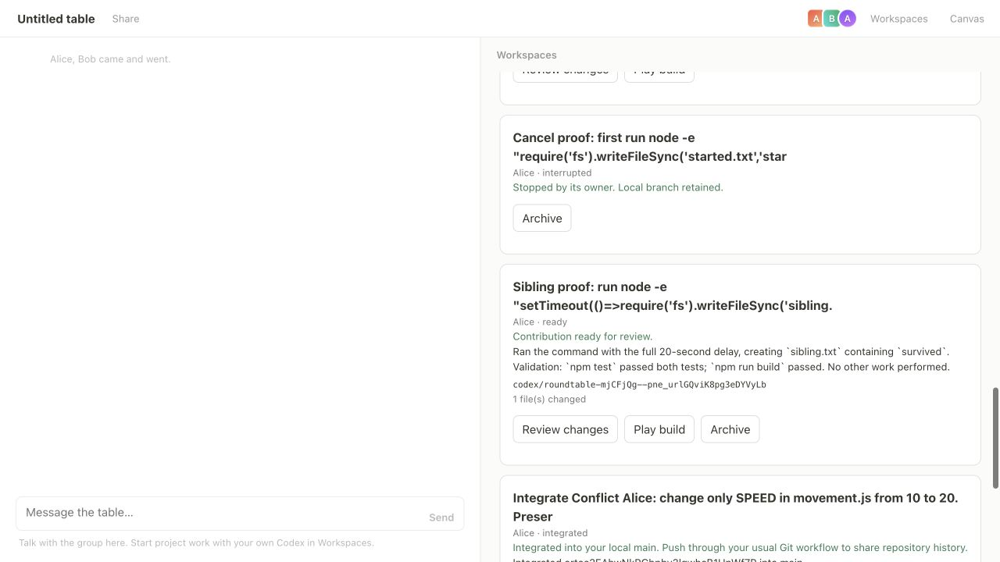

# Roundtable — recorded live rerun

**Result: all three scenarios passed after the cancellation fix.**

Six real `gpt-6-astra` tasks ran through two personal bridges on Codex CLI 0.153.3. Task submission, review, integration, game interaction, refresh, and Stop used the browser UI. The screenshots below capture those interactions.

| Scenario | Recorded result |
| --- | --- |
| Parallel features | Dash and coin tasks ran together; original checkouts stayed unchanged until integration; two dashes in the combined build reached position 100 with one coin. |
| Conflict | Speed 20 integrated; competing speed 30 was rejected; accepted HEAD remained unchanged and the target checkout stayed clean. |
| Cancellation | After Stop, the delayed completion file remained absent past its 45-second deadline; a sibling task completed its full 20-second command. No spurious 403 in the bridge log. |
| Regression suite | All 27 automated tests passed. |

The fix interrupts the model turn and cleans its background terminals before releasing the local task. Cancelled runs no longer attempt to upload results using a revoked upload capability.

## Machine-checked evidence

- Conflict HEAD before and after: `2a1dc10b8652463b403d87f4848b042d821d2aad`. [Raw assertion result](conflict-check.json).
- Cancellation command started at `2026-09-04T23:22:15.585Z`; absence verified at `2026-09-04T23:23:28.047Z`. [Raw assertion result](cancellation-check.json).
- [All task records and checks](tasks.json), [unchanged-baseline assertion](baseline-check.json), [environment and source hashes](environment.json), [unit-test output](unit-tests.txt).
- [Alice bridge outcomes](alice-results.txt) and [Bob bridge outcomes](bob-results.txt).

## Captured walkthrough

### Two real Astra tasks running concurrently

### Review gate: integration disabled until acceptance

### Combined game before interaction

### One dash advances 50 units

### Two dashes reach position 100 and collect one coin

### Conflicting integration rejected

### Cancelled task stopped; sibling task finished

## Scope

Two independent browser identities and local clones used the same Codex login on one machine. Separate accounts, remote networking, and a production game were not tested. The fixture is a small deterministic browser game. Screenshots are individual captured steps.
