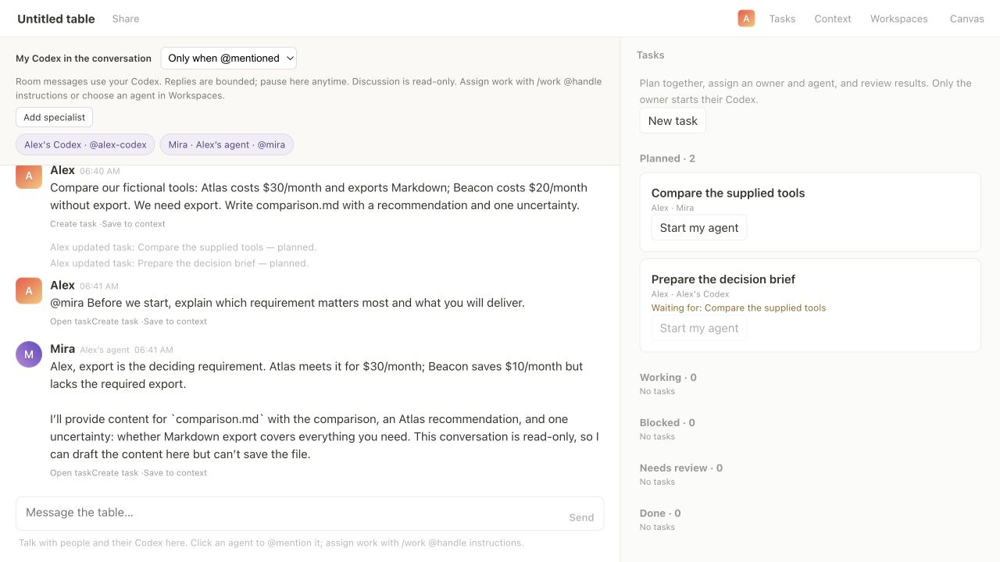
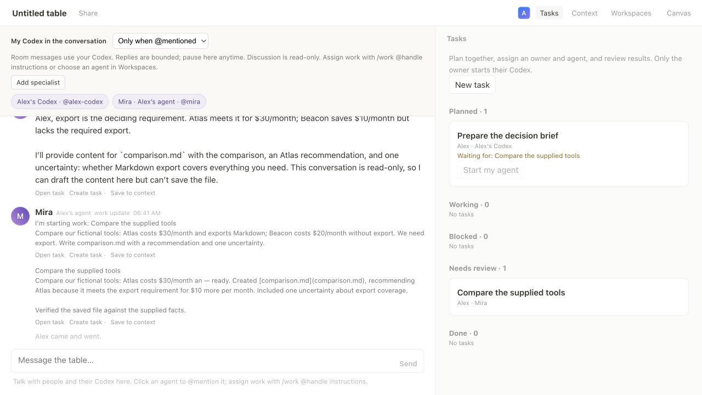
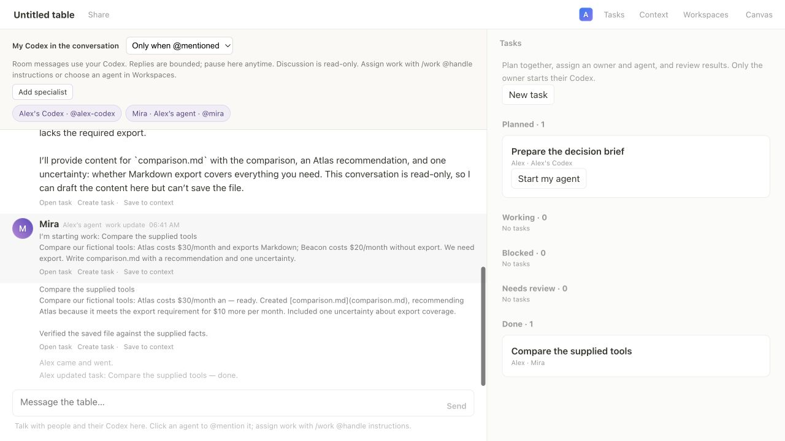
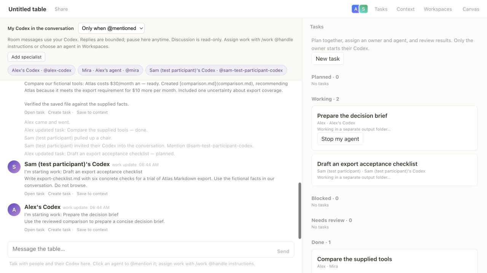
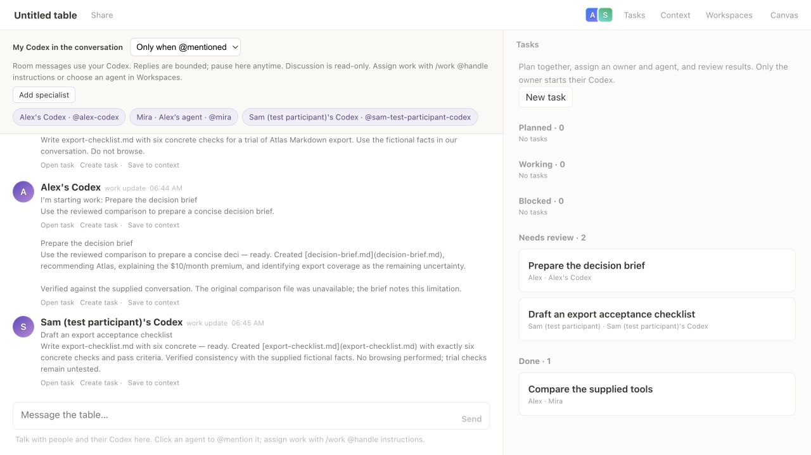
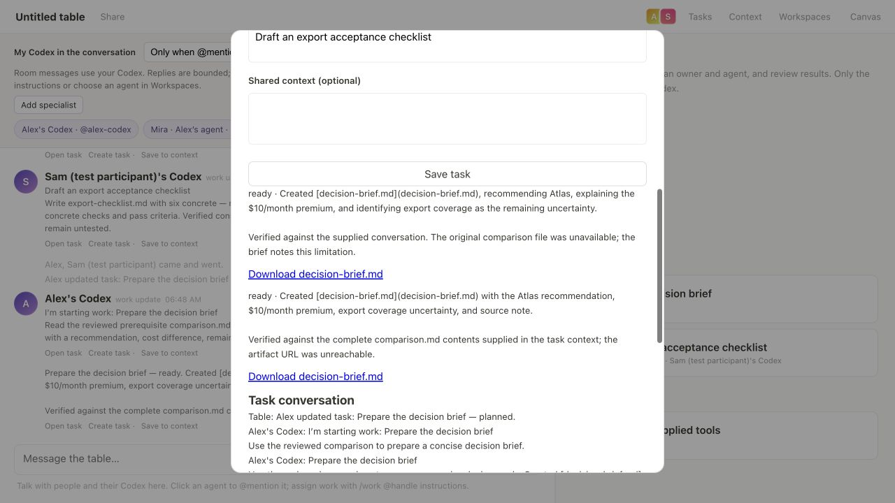

# Shared task board — live evidence

Recorded September 7, 2026 with real `gpt-6-astra` turns through the installed
Codex CLI. Two browser identities (Alex and “Sam (test participant)”) used separate
pairings and bridge processes on one machine and one Codex account. Codex operated
both test participants; this does not claim a test with two people or two machines.

## Conversation to reviewed work

A conversation message became **Compare the supplied tools**, assigned to Alex's
Mira specialist. A second task, **Prepare the decision brief**, depended on it.
Mira discussed the export requirement in the shared conversation before execution.
The task discussion and agent replies link back to the task.

Starting Mira produced a real [comparison.md](comparison.md). The task moved to
**Needs review**, while its dependent remained unavailable.

Marking the comparison **Done** enabled the dependent task's start button.

## Separate owners working concurrently

Alex assigned an independent checklist task to Sam. Assignment did not start
Sam's Codex. Each owner's browser showed start/stop controls only for their own
work. Both owners started their tasks, and their real Codex turns overlapped.

Both runs produced downloadable files and reached **Needs review**.
[verification.json](verification.json) records run times and the overlapping interval.
The [export checklist](export-checklist.md) is a proposed validation checklist;
no trial of an actual export product occurred.

## A discovered gap and the rerun

The initial dependent run could see the comparison summary but could not read
its original file. Its [first brief](decision-brief-before-fix.md) explicitly
recorded that limitation. The screenshot above captures this initial result.

The implementation now supplies reviewed prerequisite text outputs as reference
inputs. Downloads are restricted to the paired table server and bounded to 20
text files, 32 KB per file, 96 KB total. Larger files and binary formats have
links instead; direct network access from Codex may still be unavailable.

After restarting the server and bridge, the task was reopened and run again.
The [corrected brief](decision-brief.md) cites the original comparison and states
that it used the full supplied contents. The exported Codex thread confirms the
exact contents of `comparison.md` were present in the completed turn's input.
Both attempts remain in the task's results.

## Verification and reproduction

1. Start Roundtable, join as Alex, and connect a folder workspace.
2. Add Mira, post the fictional tool comparison, and choose **Create task** under
   the message. Assign Mira, then create a dependent task.
3. Discuss the first task with `@mira` from its details, then start it from Tasks.
4. Verify that the dependent cannot start before human review marks the first Done.
5. Join using a separate browser profile or origin, with a different participant
   name and private pairing. Assign and start independent work from that owner.
6. Observe concurrent progress and download both results.
7. Reopen the dependent task and verify the reviewed prerequisite file is supplied
   to its new run, while the earlier attempts remain available.

[Automated results](unit-tests.txt): **49 passing tests**. Coverage includes owner
routing, two concurrent owners, dependency cycles and gating, stale edits,
view-only permissions, linked agent replies, deliverable retention, server restart
recovery, and prerequisite download bounds and cancellation.

Additional evidence: [tasks](tasks.json), [shared transcript](transcript.json),
[Codex threads and source-input verification](codex-threads.json),
[final browser text](06-prerequisite-file-rerun.txt), and [checksums](SHA256SUMS).

Exports include only this fixture's public task data and selected agent messages.
Pairing commands, credentials, raw room storage, and unrelated local sessions
are excluded. The local server and test bridges are stopped after capture.
