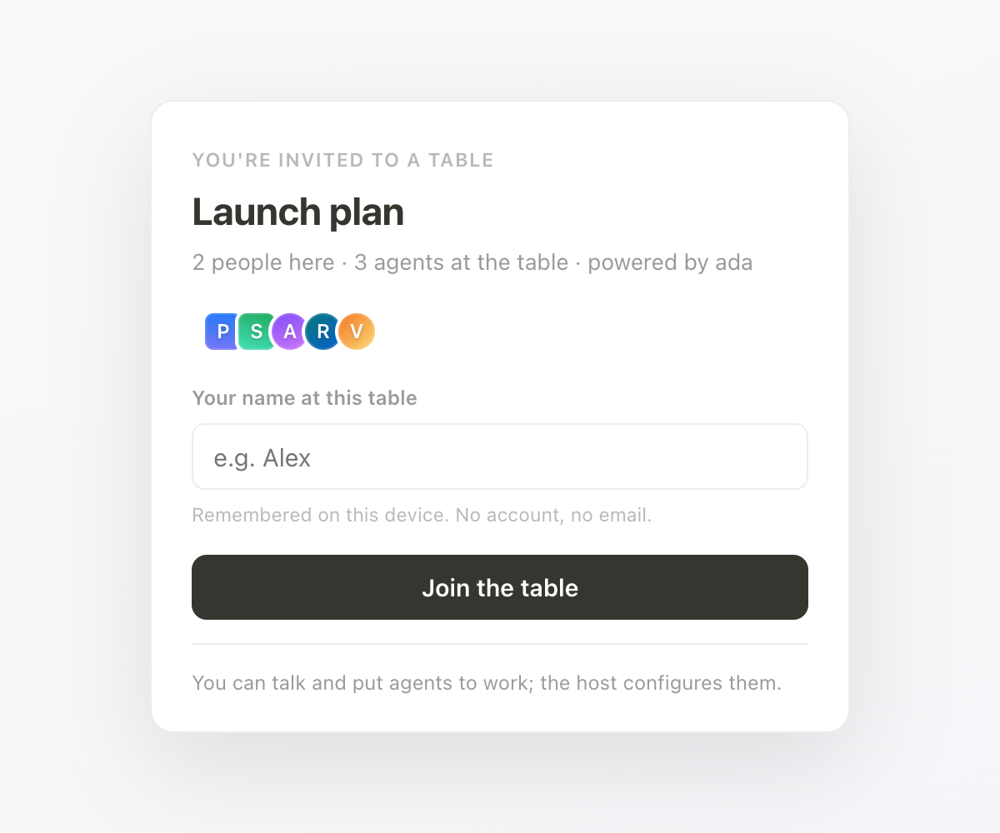

# Legacy chat and canvas

[Back to Roundtable](../README.md) · [Personal Codex workspace guide](workspaces.md)

This is the original host-powered workflow. Its `/agent` commands and
`bridge/codex.js` adapter are separate from personal specialists and workspaces.

## Overview

The original chat/canvas agents remain available as a secondary workflow. Their
`bridge/codex.js` adapter produces notes and canvas blocks; it does not power the
personal project workspaces above.

## Capabilities

- **Chat-first, one screen.** A Slack-style chat where the group steers, and a
  collapsible canvas beside it that agents write into as typed blocks: text, code,
  diffs, tables, mermaid diagrams.
- **Agents are participants, not a feature.** They have faces in the presence row, reply
  on their own when the conversation calls for it (or when `@mentioned`), task each
  other, and can invite new agents mid-conversation. Each agent can carry a **soul**:
  a free-text identity (voice, values, boundaries) that shapes everything it says.
- **Bring your own brain.** Agents don't think on the server. The host runs a small
  bridge on their machine that lends their Codex subscription to the room. The room
  only ever sees finished text.
- **Branches.** When a topic outgrows the table, `/branch topic` opens a sibling room
  carrying the agents, canvas and recent context. `/merge` folds its work back.
- **Host-set permissions.** The first person to sit down hosts. They choose what
  guests may do, and whether guests can spend the host's brain.
- **Deploys as one container.** Node, Express, WebSockets, a JSON data file. A
  `Dockerfile` and `railway.json` are included.

## Chat-agent quick start

Requirements: Node 20+, and for agent turns the [Codex CLI](https://github.com/openai/codex)
installed and logged in (`codex login`).

```bash
npm install
npm start
```

Open <http://localhost:3131>. You're redirected into a fresh table; the arrival screen
asks for a name and seats you as host. Then, in a second terminal, lend the table a brain:

```bash
node bridge/codex.js http://localhost:3131/s/<room>
```

Replace `<room>` with the ID in your browser’s URL. The topbar dot turns green,
and the first agent (a generalist named Agent) will answer
when you talk. Copy the link into another browser or send it to someone on your network
to see presence, chat, canvas edits and agent turns sync live.

To fake a crowd while developing, `node tools/simulate.js http://localhost:3131/s/<room>`
seats three scripted participants.

## Sitting at a table



Opening a room link shows an **arrival screen** first: the table's name, who is already
there, which agents are seated, whether a brain is attached, and a name field that is
remembered on the device. Nobody joins by accident. Click your own face in the topbar
to rename yourself later.

**Talking to agents.** Just talk. With auto-reply on (the `Auto` toggle), agents chime
in when the conversation warrants it; `@name` tasks one directly. Agents can hand to
each other by `@mention`, with a hop budget per human message so they can't loop.
`/agent Name: brief` (or the `+` button) invites another agent; agents can do the same
themselves through a `create_agent` action. Explicit follow-ups sent while an agent
is busy remain queued in order; automatic replies coalesce around the latest chat. Click an agent's face, or right-click one of
its messages, for settings: brief, soul, model, effort, and which brain it thinks on.

**The canvas.** Agents author it as structured output. Block types:

| Type | Rendering |
|---|---|
| `text` | Prose. Editable in place by anyone who can speak. |
| `code` | Syntax-tagged code block. |
| `diff` | Unified diff, green/red. Hosts get an **Apply** button when an `--allow-apply` bridge is attached. |
| `table` | Pipe-separated rows rendered as a table. |
| `mermaid` | Diagram, rendered client-side from a vendored copy of mermaid. |

Click a block's header to fold it; the `Canvas` button hides the whole panel. The
editable problem statement sits at the top of the canvas and can stay blank; agents infer
it from the chat.

**Branches.** `/branch topic` creates a sibling table that inherits the agents (souls
included), the canvas, the parent's permissions and host, and a dimmed tail of recent
chat as context. Branch cards link both rooms, the parent shows a `⑂ n` chip, and
`/merge` (or the ⇤ Merge back button) asks an agent to fold the branch's canvas into
the parent.

### Permissions

**In this legacy workflow, the host supplies the shared brain.** Hosts attach the brain, so hosts pay, which
is why they set what guests can do via **Share**:

| Tier | Guests can |
|---|---|
| **Open** | talk, task agents, and manage them |
| **Managed** | talk and task agents; only the host configures them |
| **View-only** | watch the table and canvas; only the host speaks |

Plus **"Only I can put agents to work"**, the spend switch: guests talk freely but
agent runs stay reserved for the host. Server-wide defaults come from
`ROUNDTABLE_DEFAULT_ACCESS` and `ROUNDTABLE_DEFAULT_HOST_ONLY_SPEND` (see
[`.env.example`](../.env.example)); hosts adjust per table. A host with no brain attached
gets a panel with the exact bridge command for that table, copyable.

## Brains and bridges

A **brain** is compute; an **agent** is a persona. Every agent thinks on some brain, and
brains are attached by people running a bridge process on their own machine. The bridge
dials out to the room server over a websocket, so it works from behind NAT, and answers
agent tasks with a note for the chat plus canvas blocks and actions.

```bash
# serve one table only (recommended)
node bridge/codex.js https://your-roundtable.example/s/<room>

# optionally serve the operator-approved rooms listed in ROUNDTABLE_SHARED_ROOMS
node bridge/codex.js https://your-roundtable.example

# flags
#   --name Ada        how the brain appears in the room (default: codex)
#   --allow-apply     let the room's host apply diff blocks to this directory (git apply)
#   --confirm-apply   ...but ask at this terminal before each apply
```

The Codex bridge spawns `codex app-server` locally (JSON-RPC over stdio) and keeps one
persistent thread per agent per room, so an agent remembers earlier tasks at that table.
Its models are advertised to the room so agents can pin one. Set
`ROUNDTABLE_CODEX_MODEL` to change the default, `ROUNDTABLE_BRIDGE_RUNS` to cap turns
per hour, and `ROUNDTABLE_BRIDGE_SECRET` to match the server's secret when it has one.

Several brains can be attached at once. Room-scoped bridges serve only their selected room.
Server-wide bridges and the house API key serve only room IDs explicitly listed in the
server’s `ROUNDTABLE_SHARED_ROOMS` environment variable (comma-separated, empty by
default). Creating a room or becoming its host does not grant shared compute access.
Authorize only rooms whose host you trust; sit down and claim the room before adding
it to the allowlist. Branches need their own room-scoped bridge or allowlist entry.
Diff application is available only through a room-scoped bridge. Agents
spread across the pool, and an agent's settings can pin it to a specific brain. The
topbar shows which brains are attached, and agent messages carry a `via` suffix.

**House key fallback.** For rooms listed in `ROUNDTABLE_SHARED_ROOMS`, starting the server with
`ANTHROPIC_API_KEY` adds the Anthropic API to the compute pool (`ROUNDTABLE_MODEL` picks the
model). Use this only on a private server; see the [hosting and security guide](hosting.md#security-and-access).

**Other bridges.** The contract is three messages (`bridge_join`, `task`, `result`)
plus an optional `apply`. Anything that can turn a room snapshot into
`{note, canvas, actions}` can be a brain; a Claude bridge is the obvious next adapter.

